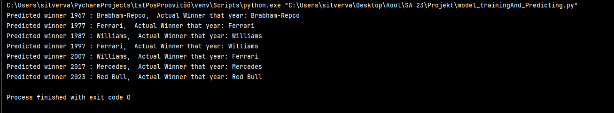

# Project_D15
# Formula 1 Winners Prediction Over Seven Decades. #

## Goal: The aim of this project is to create a model capable of predicting the Formula 1 winner across seven different decades. PLEASE NOTE! The project goal has changed in the meantime. ##
### Previous Goal: Divide the dataset into three parts and predict the winner three times -> Divide the dataset into seven decades and then predict the potential winners based on the data and the model in sync. ###

All data processing scripts, namely "relations.py," "data_cleaning.py," and "data_separation.py," are provided. Follow these steps:

1. Open/load "relations.py," resulting in the creation of the "all_constructors.csv" file.
2. Execute the code in "data_cleaning.py," resulting in the cleaned dataset named "clean_data.csv."
3. After that, run "data_separation.py," which divides the data into decades.

If you prefer not to go through this process, pre-processed datasets named "cleaned_data_period_1-10.csv" are also available.

### If you want to display predictions on your machine, copy or download the code "model_trainingAnd_Predicting.py." ###

This is the main code containing the model that successfully solves the originally stated problem in the project. When you run the program, it will return the prediction results for each decade as a string, along with the actual results (who actually won).

## For the code to work, make sure that all datasets and code snippets are in the same folder! ##

## Output when everything is done correctly: ##

